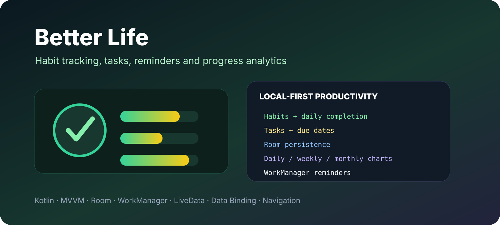

<p align="center"></p>

# Better Life

A local-first Android productivity application for building habits, managing tasks, receiving reminders and reviewing progress over time.

> This repository is a fork of [Salmon-family/Better_Life](https://github.com/Salmon-family/Better_Life). The upstream project contains the original collaboration history.

## Features

### Habit tracking
- create habits
- assign point values
- edit and delete habits
- record daily completed habits
- prevent duplicate daily completion flows
- persistent habit history

### Tasks
- create dated tasks
- mark tasks complete/incomplete
- edit tasks
- delete tasks
- persist tasks locally with Room

### Statistics
The app aggregates habit points over different time windows and exposes chart data for:

- daily progress
- weekly progress
- monthly/yearly progress

### Reminders
A WorkManager-based scheduler creates a recurring daily reminder. The current implementation schedules the notification around 22:00 when the initial delay is calculated before that time.

## Architecture

```
UI (Fragments + Data Binding)
        |
        v
ViewModels + LiveData
        |
        v
BetterRepository
        |
        v
Room DAOs
        |
        v
SQLite database
```

The project contains dedicated screens for home, habits, tasks and statistics, plus dialogs for adding/editing habits and tasks.

## Data model

The Room database includes:

- `Habit` — habit name and point value
- `DailyHabits` — relation between a date and completed habit
- `Task` — note, date and completion state

The repository exposes queries for daily completion, date-range point totals, weekly summaries, yearly summaries and oldest recorded dates.

## Tech stack

| Area | Technology |
| --- | --- |
| Language | Kotlin |
| Architecture | MVVM |
| Local database | Room |
| Async | Coroutines |
| State | LiveData |
| Background work | WorkManager |
| Navigation | Android Navigation Component |
| UI | XML + Data Binding |
| Charts | AAChartCore-Kotlin |
| Animation | Lottie |

The app targets Android API 32 and supports devices from API 21.

## Project structure

```
app/src/main/java/com/karrar/betterlife/
├── data/
│   ├── database/
│   │   ├── entity/
│   │   ├── HabitDao.kt
│   │   └── TaskDao.kt
│   └── repository/
├── ui/
│   ├── home/
│   ├── habits/
│   ├── tasks/
│   └── statistics/
└── util/
    └── workManager/
```

## Build

Requirements:

- Android Studio
- Android SDK 32
- JDK compatible with the Android Gradle Plugin used by the project

Build:

```bash
./gradlew assembleDebug
```

Test:

```bash
./gradlew test
```

## Offline behavior

The core application data is stored locally in Room. Habit and task functionality therefore does not depend on a remote backend.

## Repository note

No explicit license file is included in this fork. Check the upstream repository before redistribution or relicensing.
